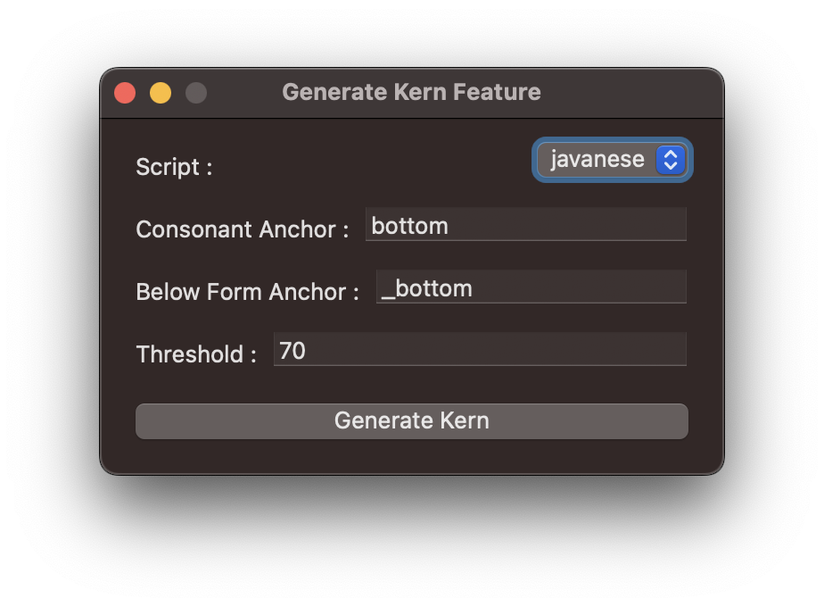
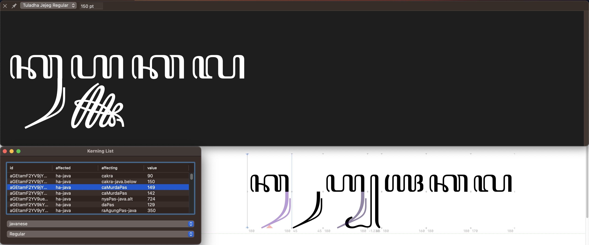

# akufadhl-glyphs-script
Collections of Glyphsapp Script

## Contextual Kerning
A collection of scripts to calculate and avoid below shape collisions in **Javanese** and **Balinese** scripts. You can try the script with this font [Tuladha Jejeg OT](https://github.com/akufadhl/Tuladha-Jejeg-OT)
  - **Calculate Kern Feature**

    Loop through Base consonants, and mark/conjuncts (below shapes). If below shapes is wider than consonant, the remaining space is added +threshold. Groups/classes is generated and added to the feature tab
    
  - **Preview Kerning List**
  
    Preview pre-generated kerning lists.
    
    
  - Generate Kerning Feature
    
    Generate and normalise name, only do it after you're sure. **NO COMING BACK**. or you can make backup first.
